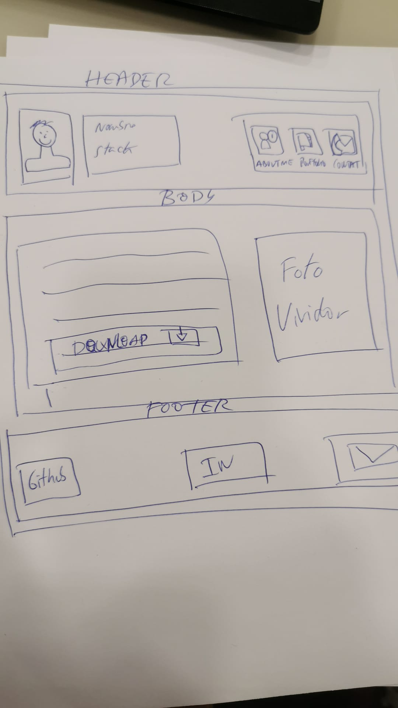
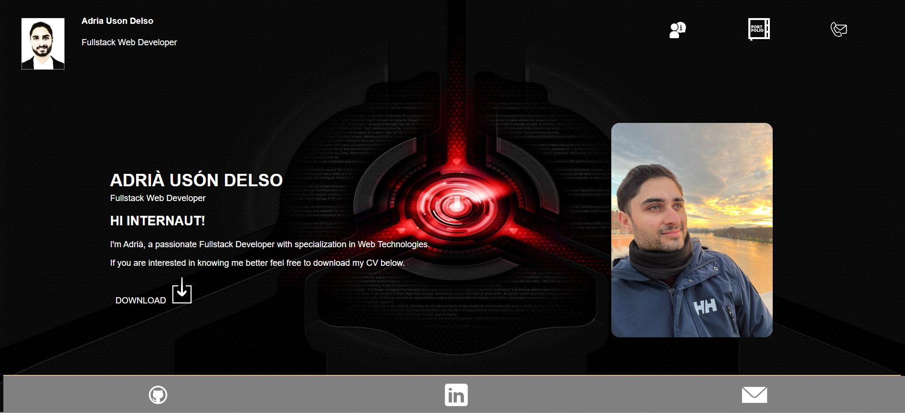
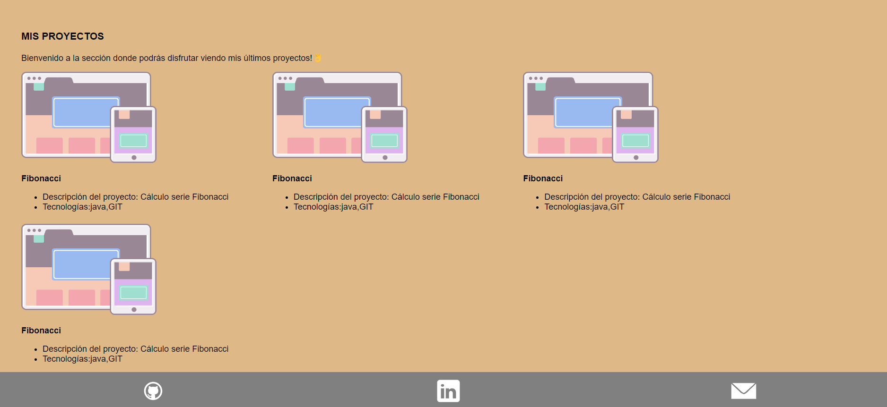
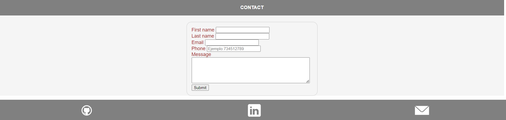

<h1>PASOS PARA REALIZAR EL PROYECTO</h1>
El proyecto consiste en realizar una web con nuestro portfolio de proyectos.
Los pasos que he realizado para este proyecto han sido:

1) Investigación de mercado: investigando diferentes portfolio para encontrar la inspiración y realizar un portfolio propio.
2) Realizar el sketch a papel
-> https://drive.google.com/drive/folders/1NonpLOPO5vCqIhM2TJuc65fhbAxeezlG

3) Mockup Header, Body, Footer de la sección ABOUT ME (sección que habla sobre mi y se puede descargar mi CV)
-> https://www.figma.com/proto/6ass8YFjCwvMvVY2fqN7cH/Adri-Portfolio?type=design&node-id=8-16&t=25isg6IwVjGHiWSa-0&scaling=scale-down&page-id=0%3A1
   
4) Desarrollarlo en HTML Y CSS
5) Configurar el proyecto con GIT
   5.1) Inicializar el proyecto con git en local con git init
   5.2) Añadir los cambios con git add + nombre archivo
   5.3) Confirmar cambios con git commit -m "first commit"
   5.4) git clone URL
   5.4) Git push para subir los cambios al repo en GITHUB
# PREVIEW

<h1>METODOLOGÍA</h1>
He utilizado la metodología SCRUM agile.
El primer sprint consiste en desplegar el menú, header, footer y body de la sección about me
-> https://trello.com/b/653eNrP8/portafolio

<h1>TECNOLOGÍAS</h1>

   <ul>
      <li>
HTML
</li>
      <li>
CSS
</li>
      <li>
GIT
</li>
   </ul>

